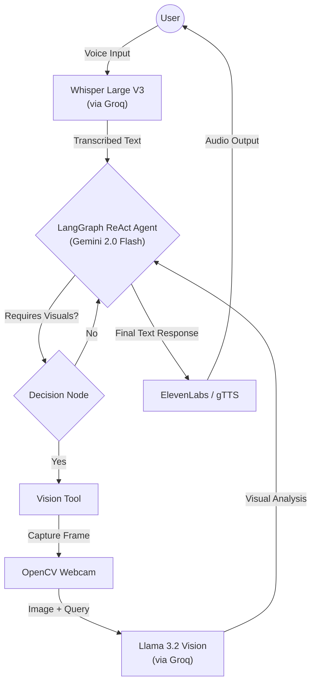

<div align="center">

# ✨ Sora: The Multimodal Agentic Assistant
### *An autonomous AI companion that doesn't just chat—it sees, hears, and acts.*

[](https://www.python.org/)
[](https://langchain-ai.github.io/langgraph/)
[](https://deepmind.google/technologies/gemini/)
[](https://groq.com/)
[](https://opensource.org/licenses/MIT)

<p align="center">
  <a href="#-project-demo">Demo</a> •
  <a href="#-key-features">Features</a> •
  <a href="#-architecture">Architecture</a> •
  <a href="#-setup-and-installation">Setup</a> •
  <a href="#-usage">Usage</a>
</p>

</div>

---

## 🎥 Project Demo

[Sora in Action](https://github.com/user-attachments/assets/ca0f894e-4c29-4be7-9d52-a51af5130792)

> *Sora identifying objects in real-time and engaging in a natural voice conversation.*
---

## 📖 Overview

**Sora** is a state-of-the-art **Agentic AI Assistant** designed to bridge the gap between text-based LLMs and real-world interaction. 

Built for the 2026 AI landscape, Sora isn't just a chatbot; it is a **ReAct Agent** (Reasoning + Acting). By orchestrating **Google Gemini 2.0 Flash** with **LangGraph**, the agent autonomously decides when to trigger its visual cortex to "see" the world. Leveraging **Groq's LPU** for sub-second inference, Sora delivers human-parity response times for speech and vision.

---

## ✨ Key Features

* **🧠 Agentic Decision Making:** Uses **LangGraph** to decide *autonomously* when it needs visual context. It doesn't look until it needs to.
* **👁️ Active Vision:** Powered by **Llama 3.2 Vision** on Groq, Sora captures and analyzes webcam frames to answer questions like *"Do I look tired?"* or *"What am I holding?"*
* **👂 Ultra-Low Latency Speech:** Near-instant transcription using **Whisper V3** on Groq's LPU hardware.
* **🗣️ Expressive TTS:** Responds with lifelike, emotive audio using **ElevenLabs** (or lightweight gTTS for offline use).
* **💻 Split-Screen UI:** A sleek **Gradio** interface featuring a live video feed alongside a real-time terminal-style chat.

---

## 🏗️ System Architecture

Sora operates on a modular pipeline where specialized models handle specific sensory inputs, all coordinated by the central Gemini "Brain." 



---

## 🛠️ Technology Stack

| Component | Technology | Role |
| --- | --- | --- |
| **Orchestration** | **LangGraph / LangChain** | Agent state management & tool routing |
| **Brain (LLM)** | **Google Gemini 2.0 Flash** | Core reasoning and instruction following |
| **Visual Cortex** | **Llama 3.2 Vision (Groq)** | Instant image-to-text analysis |
| **Hearing (STT)** | **Whisper V3 (Groq)** | Real-time speech transcription |
| **Voice (TTS)** | **ElevenLabs** | High-fidelity voice synthesis |
| **Interface** | **Gradio & OpenCV** | Web UI and webcam stream management |

---

## 🚀 Setup and Installation

### 1. Clone & Environment

```bash
git clone [https://github.com/Debojyoti2904/-Agentic-AI-Assistant-Sora.git](https://github.com/Debojyoti2904/-Agentic-AI-Assistant-Sora.git)
cd Sora-Agentic-Assistant
python -m venv venv
source venv/bin/activate  # Windows: venv\Scripts\activate

```

### 2. Install Dependencies

```bash
pip install -r requirements.txt

```

### 3. API Configuration

Create a `.env` file in the root directory:

```env
GOOGLE_API_KEY="your_gemini_key"
GROQ_API_KEY="your_groq_key"
ELEVENLABS_API_KEY="your_elevenlabs_key"

```

---

## 🎯 Usage

1. **Start the Assistant:**
```bash
python sora.py

```


2. **Enable Vision:** Click the **"Start Camera"** button in the Gradio UI.
3. **Talk to Sora:**
* *Natural Query:* "Hey Sora, what do you think of my setup?"
* *Action:* Sora will capture a frame, analyze the room with Llama 3.2, and speak its feedback.


4. **Chat History:** Review the text logs in the sidebar while listening to the audio response.

---

## 🗺️ Roadmap

* [ ] **Long-term Memory:** Integrate VectorDB for project-specific memory.
* [ ] **Action Execution:** Allow Sora to control local applications (Spotify, Browser).
* [ ] **Multi-turn Vision:** Continuous video stream analysis instead of snapshots.

---

<div align="center">
<p>Built with ❤️ for the 2026 Agentic AI Era.</p>
<p><b>Star this repo if you find it helpful! ⭐</b></p>
</div>

```
